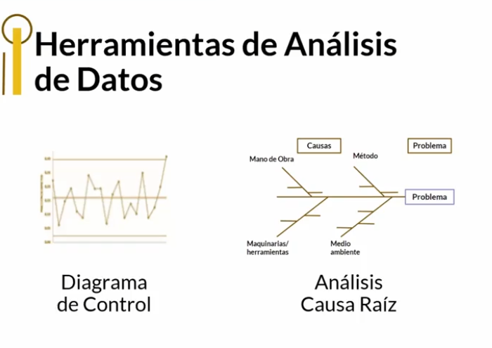
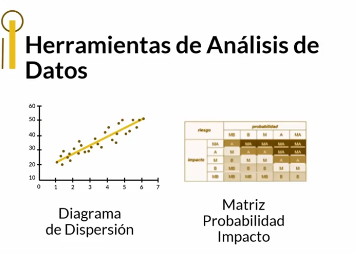
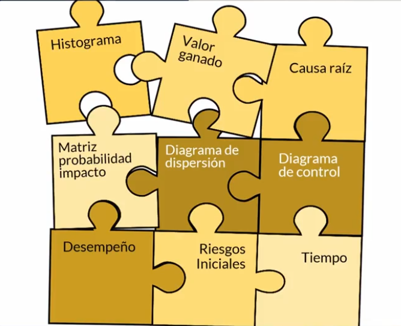

# Ciencia de Datos en la Gestión de Proyectos

Este **Dashboard de Ciencia de Datos en la Gestión de Proyectos** está diseñado para mostrar cómo la ciencia de datos está transformando la gestión moderna de proyectos. A través de la integración de herramientas de análisis de datos, Business Intelligence y automatización, este recurso permite optimizar la toma de decisiones, aumentar la productividad y mejorar el rendimiento del equipo en cada etapa del proyecto.

## Ejemplos de Herramientas de Análisis de Datos

|  |  |  |
|:---:|:---:|:---:|
| **Visualización de Análisis** | **Herramienta para Inteligencia Colectiva** | **Dashboard de Indicadores** |

## Análisis de Datos

El análisis de datos permite a las organizaciones aprovechar la inteligencia colectiva y mejorar la toma de decisiones informadas mediante herramientas de transformación digital, Big Data y analítica avanzada. Estas capacidades elevan la eficiencia de recursos, mejoran la previsión de riesgos y fortalecen la calidad de las decisiones estratégicas.

*Diagrama que ilustra el flujo de trabajo en análisis de datos.*

- **Beneficios del análisis de datos en la gestión de proyectos**: Al analizar grandes volúmenes de datos, los gestores pueden identificar patrones en el desempeño de proyectos anteriores, predecir resultados futuros y ajustar estrategias en tiempo real, lo que promueve la adaptabilidad en entornos dinámicos.

- **Toma de decisiones informadas**: El uso de técnicas como el *Machine Learning* y la analítica predictiva permite a los líderes prever problemas antes de que ocurran, optimizando la asignación de recursos.

- **Inteligencia colectiva**: Los dashboards que incluyen datos accesibles para todos los miembros del equipo promueven la inteligencia colectiva. Con métricas en tiempo real, cada integrante puede contribuir a mejorar el desempeño del proyecto.

## Ruta: Herramientas de Negocios

Para maximizar el impacto del análisis de datos en la gestión de proyectos, es fundamental integrar herramientas de negocio que faciliten la organización y la productividad del equipo. Estas herramientas son clave para implementar estrategias basadas en datos y mejorar el flujo de trabajo.

|  |  |  |
|:---:|:---:|:---:|
| **Gestión de Tareas y Productividad** | **Automatización de Procesos** | **Visualización de Datos** |

## Ruta: Análisis de Datos y Business Intelligence

El análisis de datos y Business Intelligence son críticos para identificar patrones, realizar predicciones y desarrollar estrategias informadas en la gestión de proyectos.

- **Identificación de patrones y tendencias**: Los modelos de Machine Learning y minería de datos permiten descubrir patrones de éxito o fracaso en proyectos anteriores, ajustando tácticas en tiempo real.

- **Predicción de riesgos**: La analítica predictiva anticipa posibles riesgos y desafíos, permitiendo a los gestores tomar medidas proactivas.

- **Creación de reportes y visualizaciones estratégicas**: Transformar datos en informes comprensibles y visualizaciones impactantes es clave para tomar decisiones informadas. Herramientas como *Google Data Studio* y *Power BI* permiten crear reportes que resaltan insights críticos para los stakeholders.

## Conclusión

La ciencia de datos es un pilar fundamental en la gestión de proyectos moderna, aportando herramientas y metodologías que optimizan la toma de decisiones, incrementan la productividad y mejoran el rendimiento del equipo. A través del análisis de datos avanzado, la identificación de patrones y la automatización de procesos, los gestores pueden obtener resultados superiores y adaptarse rápidamente a los cambios. Este dashboard actúa como un recurso estratégico para implementar una cultura de datos y maximizar el valor de cada proyecto.

